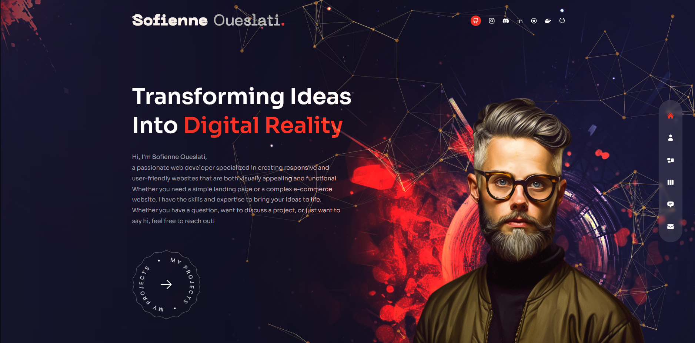
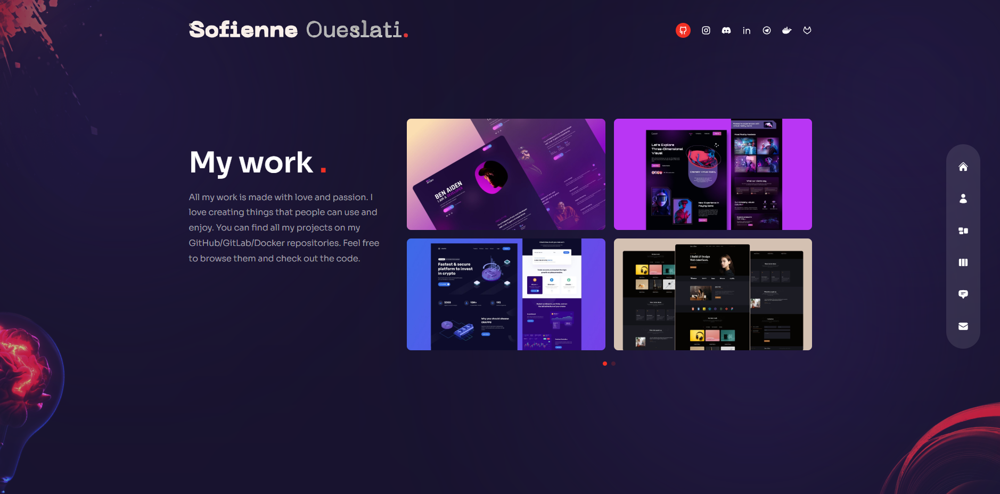

# Sofienne Oueslati's Portfolio



Welcome to the portfolio of **Sofienne Oueslati** — a passionate Full-stack Web Developer with over a decade of experience building robust, scalable, and visually stunning web applications. This portfolio is a showcase of my journey, skills, and the projects that define my professional identity.

---

## 🚀 Live Website

[](https://cocami.vercel.app)

Explore the live version to experience the interactive UI, smooth animations, and responsive design in action.

---

## 🌟 About Me

Hi! I'm Sofienne, a developer who thrives on turning ideas into digital reality. My expertise spans both frontend and backend technologies, with a focus on delivering seamless user experiences and clean, maintainable code. I love collaborating, learning new tools, and pushing the boundaries of what's possible on the web.

- 🧑‍💻 **Role:** Full-stack Web Developer
- 🗺️ **Location:** Tunisia
- 💼 **Experience:** 10+ years
- 🛠️ **Tech Stack:** JavaScript, TypeScript, React, Next.js, Node.js, Tailwind CSS, Framer Motion, Docker, and more.

---

## 🌐 Socials

[](https://github.com/CocaMi)
[](https://www.linkedin.com/in/sofienne-oueslati-001274259)
[](https://www.instagram.com/cocami1230)
[](https://discord.com/users/301816089879511040)

---

## ⭐️ Follow & Support

[](https://github.com/CocaMi)
[](https://paypal.me/CocaMi)

---

## ✨ Features

- **Modern UI/UX:** Clean, responsive design with a focus on accessibility and user engagement.
- **Animated Transitions:** Smooth page transitions and interactive effects powered by Framer Motion.
- **Project Showcase:** Detailed cards for each project, including descriptions, tech stack, and links.
- **Testimonials:** Real feedback from clients and collaborators.
- **Contact Form:** Integrated email contact form for easy communication.
- **Performance Optimized:** Fast load times and optimized assets.
- **Mobile Friendly:** Fully responsive layout for all devices.
- **Open Source:** Codebase available for learning and contributions.

---

## 🖼️ Screenshots

| Home Page | Projects | Contact |
|-----------|----------|---------|
|  |  |  |

---

## 🛠️ Built With

- **Next.js** — React framework for production-grade web apps
- **React** — Component-based UI library
- **Tailwind CSS** — Utility-first CSS for rapid styling
- **Framer Motion** — Powerful animation library for React
- **Docker** — Containerization for easy deployment
- **Vercel** — Hosting and CI/CD

---

## 📦 Getting Started

Clone the repository and run locally:

```bash
git clone https://github.com/CocaMi/Sofienne-Portfolio.git
cd Sofienne-Portfolio/Portfolio
npm install
npm run dev
```

Visit [http://localhost:3000](http://localhost:3000) to view the site.

---

## 🤝 Contributing

Contributions, issues, and feature requests are welcome! Feel free to check the [issues page](https://github.com/CocaMi/Sofienne-Portfolio/issues) or submit a pull request.

1. Fork the repository
2. Create your feature branch (`git checkout -b feature/AmazingFeature`)
3. Commit your changes (`git commit -m 'Add some AmazingFeature'`)
4. Push to the branch (`git push origin feature/AmazingFeature`)
5. Open a pull request

---

## 📬 Contact

- **Email:** [sofienne.oueslati@gmail.com](mailto:sofienne.oueslati@gmail.com)
- **LinkedIn:** [sofienne-oueslati-001274259](https://www.linkedin.com/in/sofienne-oueslati-001274259)
- **Discord:** CocaMi

---

## 📄 License

This project is licensed under the MIT License.

---

> _Thank you for visiting my portfolio! If you like my work, feel free to connect or support me via the links above._
