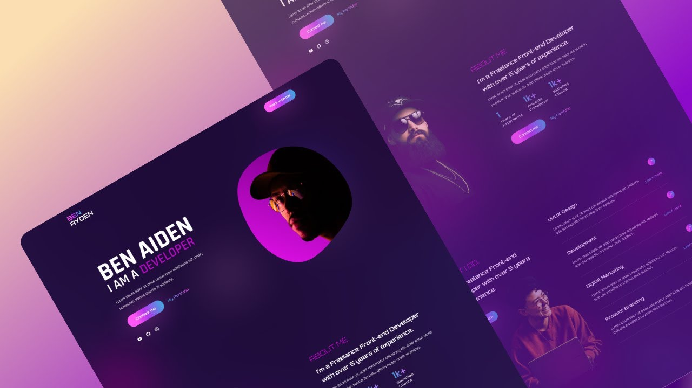

# Sofienne Oueslati's Portfolio



A modern, visually engaging portfolio website for Sofienne Oueslati, a Full-stack web developer with 10+ years of experience. Built with Next.js, React, Tailwind CSS, and Framer Motion, this project showcases professional projects, testimonials, and interactive UI effects.

## 🚀 Live Website

[](https://cocami.vercel.app)

## 🌐 Socials

[](https://github.com/CocaMi)
[](https://www.linkedin.com/in/sofienne-oueslati/)
[](https://twitter.com/sofienneoueslati)

## ⭐️ Follow & Support

[](https://github.com/CocaMi)
[](https://www.buymeacoffee.com/sanidhy)

---

## ✨ Features

- Responsive, modern UI/UX
- Animated transitions and effects
- Project and testimonial showcase
- Contact form with email integration
- Built with Next.js, React, Tailwind CSS, Framer Motion

## 📦 Getting Started

```bash
git clone https://github.com/CocaMi/Sofienne-Portfolio.git
cd Sofienne-Portfolio/Portfolio
npm install
npm run dev
```

## 📄 License

This project is licensed under the MIT License.
